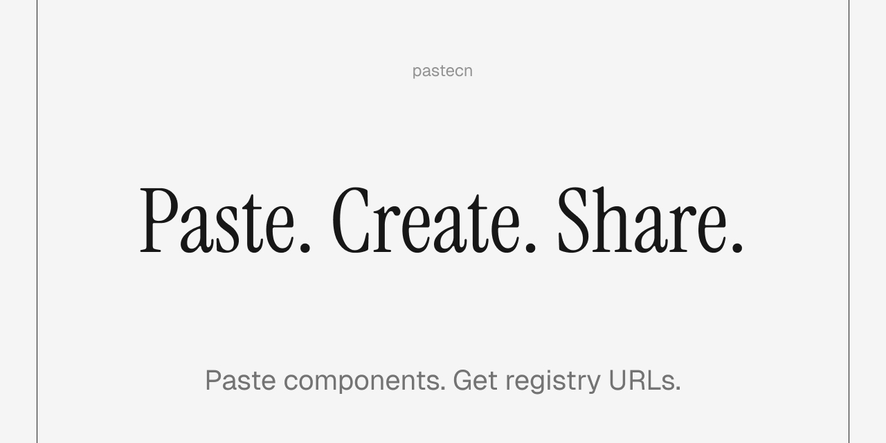

# pastecn

[](https://marketplace.visualstudio.com/items?itemName=pastecn.pastecn)
[](LICENSE.md)
[](https://pastecn.com)
[](https://github.com/rbadillap/pastecn/actions/workflows/ci.yml)
[](https://pastecn.com/blog/ai-sdk)

**pastebin + shadcn = pastecn**



Create shareable shadcn/ui registry URLs. Paste your code, get a URL that works directly with `npx shadcn@latest add`.

## Use pastecn

### Web

Paste at [pastecn.com](https://pastecn.com), get a registry URL.

### API

Create and retrieve snippets programmatically via the [REST API](https://pastecn.com/docs/api).

```bash
curl -X POST https://pastecn.com/api/v1/snippets \
  -H "Content-Type: application/json" \
  -d '{"name":"my-component","type":"component","files":[...]}'
```

#### VS Code / Cursor

Share code directly from your editor with `Cmd+Alt+S`. Works with Cursor, VSCodium, Windsurf, and any VS Code fork.

[Install from VS Code Marketplace](https://marketplace.visualstudio.com/items?itemName=pastecn.pastecn)

#### AI Agents

Use the [AI SDK tools](https://pastecn.com/blog/ai-sdk) to create snippets programmatically.

```bash
npx shadcn@latest add @pastecn/ai-sdk
```

## Features

- **VS Code Extension** - Share code directly from your editor with keyboard shortcuts
- **Link Expiration** - Set automatic expiration times (1h, 24h, 7d, 30d, or never)
- **AI SDK Tools** - Let AI agents create and retrieve snippets programmatically
- **Password Protection** - Bcrypt hashing, rate limiting, seamless CLI integration
- **Multi-file Blocks** - Share complex components with multiple files via `registry:block`
- **Instant Registry URLs** - Convert any code into shadcn-compatible endpoints
- **Zero Config** - No auth, no signup, just paste and share
- **Immutable URLs** - Once created, snippets never change

## Quick Start

1. Paste your code at [pastecn.com](https://pastecn.com)
2. Select type (component/hook/lib/block/file) and set filename
3. Click "Create Snippet" to get your registry URL

### Install a snippet

```sh
# Using namespace (shorter)
npx shadcn@latest add @pastecn/{id}

# Using full URL
npx shadcn@latest add https://pastecn.com/r/{id}
```

## Learn more

- [VS Code Extension](https://pastecn.com/blog/vscode-extension) - Share code directly from your editor
- [Link Expiration](https://pastecn.com/blog/link-expiration) - Control snippet lifetime with flexible TTL options
- [AI SDK Tools](https://pastecn.com/blog/ai-sdk) - Tools for AI agents to create and retrieve snippets
- [Password-Protected Snippets](https://pastecn.com/blog/password-protected-snippets) - Share code with selective access
- [Understanding Registry Blocks](https://pastecn.com/blog/understanding-shadcn-registry-blocks) - Multi-file components explained

## Self-Hosting

Want to run your own instance? See [docs/VERCEL.md](docs/VERCEL.md) for deployment instructions.

## Contributing

See [CONTRIBUTING.md](docs/CONTRIBUTING.md) for development setup and guidelines.

## Changelog

See [CHANGELOG.md](docs/CHANGELOG.md) for release notes and changes.

## License

Licensed under the [MIT License](LICENSE.md)
