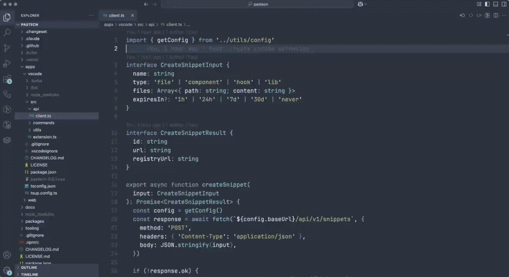

# pastecn

[](https://marketplace.visualstudio.com/items?itemName=pastecn.pastecn)
[](https://open-vsx.org/extension/pastecn/pastecn)
[](https://github.com/rbadillap/pastecn/blob/main/LICENSE.md)

Turn any code into shareable shadcn registry URLs.



## Installation

[Install from VS Code Marketplace](https://marketplace.visualstudio.com/items?itemName=pastecn.pastecn)

Also works with **Cursor**, **VSCodium**, **Windsurf**, and any VS Code fork.

## Features

- **Share Selection** — Share selected code with a keyboard shortcut
- **Share File** — Share the entire active file
- **Open Snippet** — Open a snippet by ID or URL
- **Context Menu** — Right-click to share selected code
- **Expiration Options** — Choose from 1h, 24h, 7d, 30d, or never

## Commands

| Command | Description |
|---------|-------------|
| `pastecn: Share Selection` | Share the selected code |
| `pastecn: Share File` | Share the entire file |
| `pastecn: Open Snippet` | Open a snippet by ID or URL |

## Keyboard Shortcuts

| Shortcut | Command |
|----------|---------|
| `Cmd+Alt+S` (Mac) | Share Selection |
| `Ctrl+Alt+S` (Windows/Linux) | Share Selection |

## Configuration

| Setting | Default | Description |
|---------|---------|-------------|
| `pastecn.baseUrl` | `https://pastecn.com` | Base URL for pastecn instance |
| `pastecn.defaultExpiration` | `never` | Default expiration (1h, 24h, 7d, 30d, never) |

## Self-Hosted

```json
{
  "pastecn.baseUrl": "https://your-instance.com"
}
```

## Links

- [Website](https://pastecn.com)
- [Blog Post](https://pastecn.com/blog/vscode-extension)
- [GitHub](https://github.com/rbadillap/pastecn)

## License

MIT
